<!--
name: Raul Pena (raul.pena@gmail.com)
createAt: 2026-08-08T11:43:26-0300
Description: Standard Mermaid infrastructure diagram for the AWS Terraform blueprint.
-->

# Infrastructure Diagram

This diagram represents the infrastructure created by the Terraform project across the `dev`, `staging`, and `prod` environments. Environment-specific sizing changes, but the main network and service model is consistent.

```mermaid
flowchart TB
  developer["Developer machine"]
  registrar["External domain registrar<br/>GoDaddy or similar"]
  internet["Internet"]

  subgraph aws["AWS Account / Region"]
    route53["Route 53 public hosted zone<br/>Optional in dev"]

    subgraph state["Terraform Remote State"]
      state_bucket["S3 backend bucket<br/>SSE-S3 encryption<br/>Native S3 lock file"]
    end

    subgraph vpc["VPC"]
      igw["Internet Gateway"]
      nat["NAT Gateway<br/>Optional services egress"]
      s3_endpoint["S3 Gateway VPC Endpoint"]

      subgraph public["Public subnet tier<br/>per Availability Zone"]
        public_subnet["Public subnets<br/>No automatic public IPs"]
      end

      subgraph services["Private services subnet tier<br/>per Availability Zone"]
        services_sg["Services security group"]
        app_workloads["Application workloads<br/>EKS / ECS / Fargate / EC2"]
        ssm_host["Private SSM port-forward host<br/>Dev database access"]
        ssm_endpoints["SSM interface endpoints<br/>ssm / ssmmessages / ec2messages"]
      end

      subgraph data["Private data subnet tier<br/>per Availability Zone"]
        rds_sg["PostgreSQL security group<br/>5432 from services SG only"]
        rds["Amazon RDS PostgreSQL<br/>Private endpoint"]
        valkey_sg["Valkey security group<br/>6379 from services SG only"]
        valkey["Amazon ElastiCache Valkey<br/>Private endpoint<br/>TLS enabled"]
      end
    end

    subgraph artifacts["Optional Artifact Repositories"]
      maven_bucket["S3 Maven repository<br/>Private / versioned / SSE-S3"]
      helm_bucket["S3 Helm chart repository<br/>Private / versioned / SSE-S3"]
    end

    secrets["AWS Secrets Manager<br/>RDS managed password"]
  end

  registrar -->|"Delegates NS records"| route53
  internet --> igw
  public_subnet --> igw
  services -->|"Optional outbound internet egress"| nat
  nat --> igw

  developer -->|"AWS CLI SSM session<br/>dev only"| ssm_endpoints
  ssm_endpoints --> ssm_host
  ssm_host -->|"Port forward to 5432"| rds

  app_workloads -->|"PostgreSQL 5432"| rds_sg
  rds_sg --> rds
  app_workloads -->|"Valkey 6379 over TLS"| valkey_sg
  valkey_sg --> valkey

  app_workloads -->|"Read RDS secret"| secrets
  rds -->|"Managed master password"| secrets

  app_workloads -->|"Private S3 access"| s3_endpoint
  s3_endpoint --> maven_bucket
  s3_endpoint --> helm_bucket
  s3_endpoint --> state_bucket
```

## Main Flows

- Developers do not connect directly to private RDS or Valkey endpoints from the internet.
- Dev PostgreSQL access uses AWS Systems Manager Session Manager port forwarding through the private SSM helper instance.
- Application workloads run in the private services subnet tier.
- PostgreSQL and Valkey run in the private data subnet tier.
- PostgreSQL accepts `5432/tcp` only from the services security group.
- Valkey accepts `6379/tcp` only from the services security group and expects TLS because in-transit encryption is enabled.
- S3 access from private subnets can use the S3 Gateway VPC Endpoint instead of internet routing.
- Route 53 manages DNS only after the external registrar delegates the domain to AWS name servers.

## Environment Differences

| Environment | Availability Zones | NAT Gateway | PostgreSQL | Valkey |
| --- | --- | --- | --- | --- |
| `dev` | 2 | Disabled by default | Small Single-AZ RDS | Single small cache node |
| `staging` | 2 | Enabled by default in variables | Medium validation defaults | Single small cache node |
| `prod` | 3 | One per AZ by default | Multi-AZ RDS | Two nodes with automatic failover and Multi-AZ |

## Notes

- Public subnets are available for future public entry points, but the current data services remain private.
- A bastion host is not part of this architecture. Dev database access uses SSM instead of SSH.
- Customer-managed KMS keys are intentionally not created by default to avoid fixed KMS key charges.
- Terraform state uses S3 server-side encryption with SSE-S3 and native S3 lock files.
